# 🏡 FurniVision - Modern Furniture E-commerce Website  

FurniVision is a sleek and user-friendly furniture e-commerce platform built using **Java Servlets, JDBC, MySQL, HTML, CSS, and JavaScript**. It offers a smooth shopping experience with features like product management, user management, and a functional shopping cart.  

---

## ✨ Features  

### 🔹 **Admin Panel**  
- 🛠️ Add, edit, update, and delete users  
- 📦 Add and remove products from the catalog  

### 🔹 **User Features**  
- 🛋️ **Product Sections**: Currently includes **Sofa** and **Bed** sections  
- 🛒 **Shopping Cart**: Users can add items to their cart and review selected products  
---

## 🏗️ Tech Stack  

- **Frontend**: HTML, CSS, JavaScript  
- **Backend**: Java (Servlets, JDBC)  
- **Database**: MySQL  
---

## 🛠️ Installation & Setup  

1. **Clone the repository**  
   ```sh
   git clone https://github.com/Manshi-1952/furnivision.git

   Import the project into IntelliJ

2. Set up the database
3. Import the provided SQL file into MySQL
4. Update database credentials in the project
5. Run the project

6. Start your Tomcat server
Access the website via http://localhost:8080/FurniVision


## 📷 Screenshots

### 🏠 Homepage
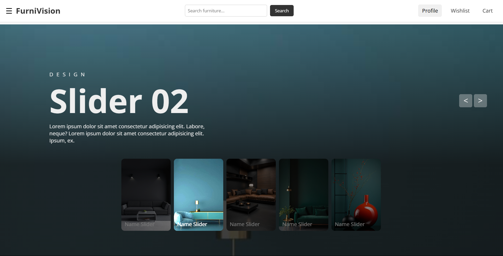
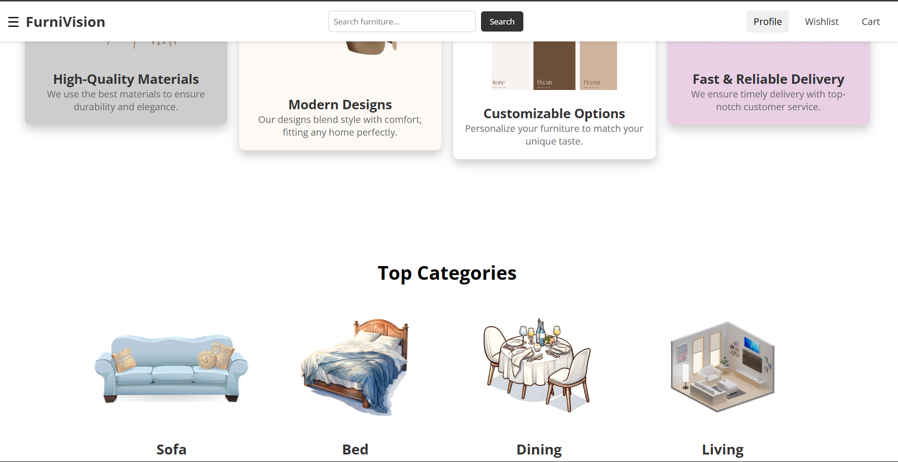
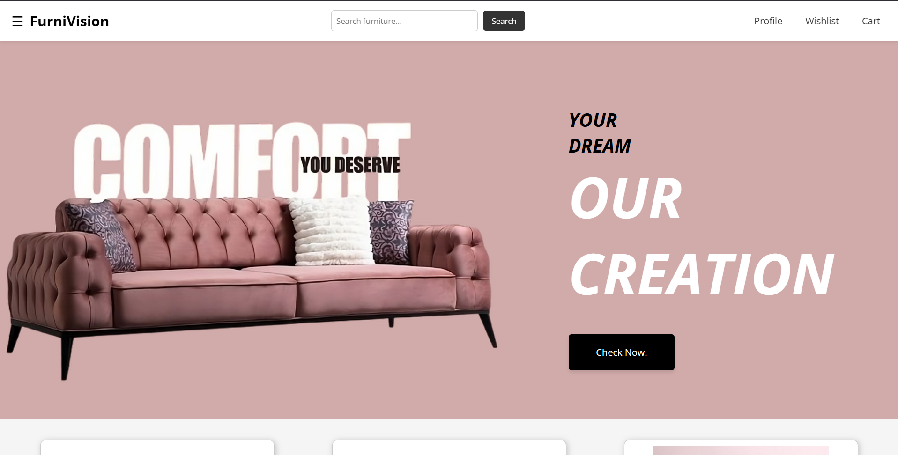
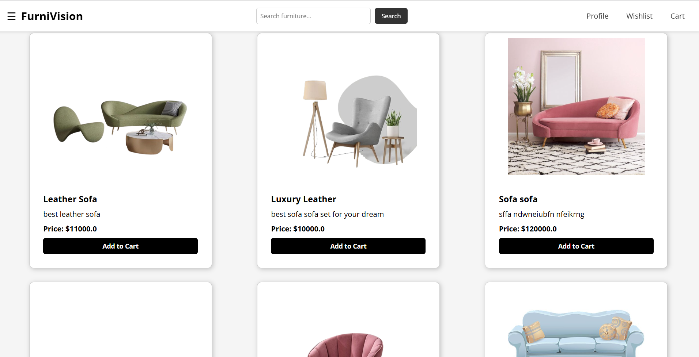
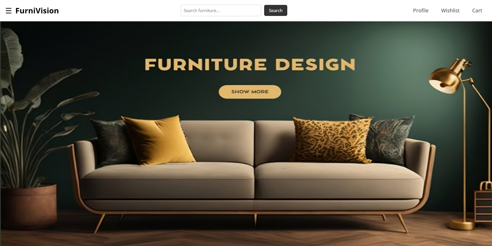
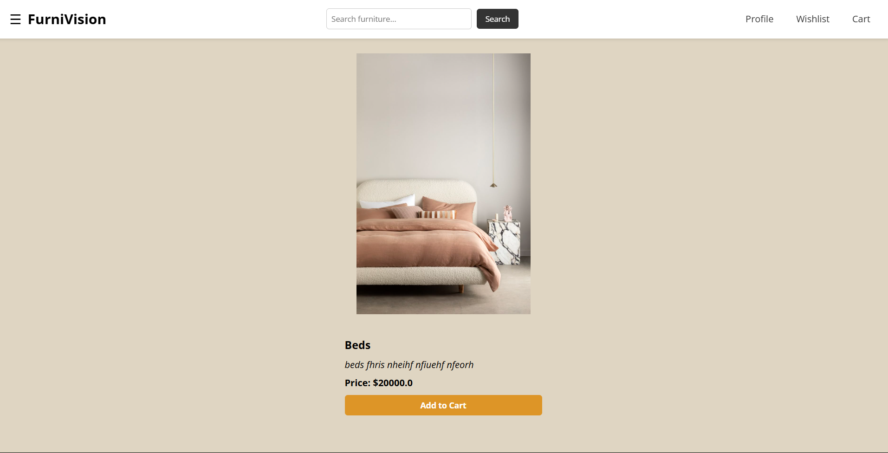
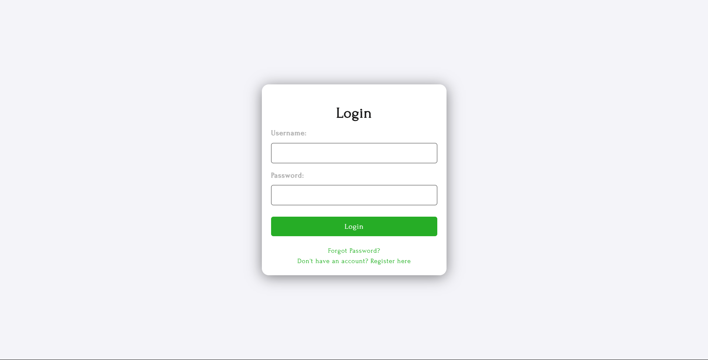

### 🛒 Cart Page
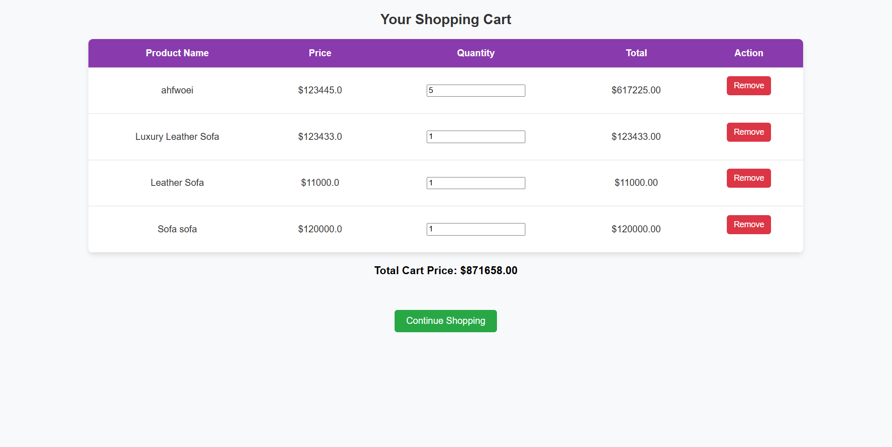

### 🛠 Admin Panel
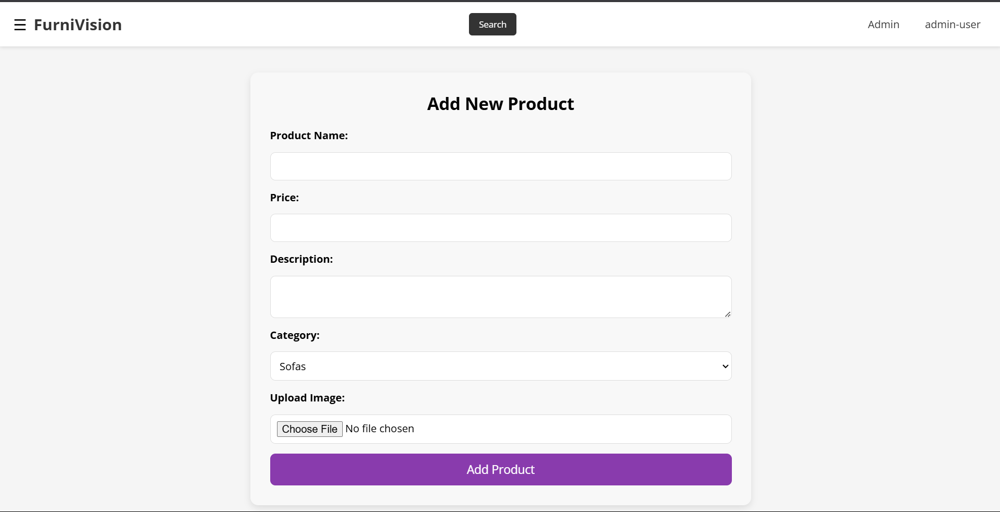
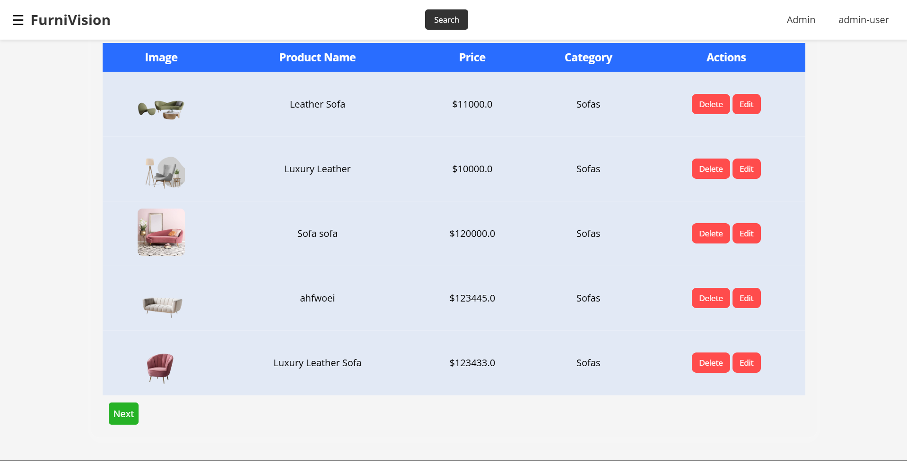
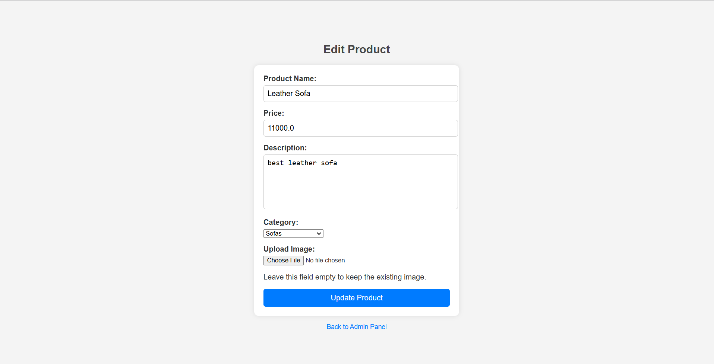
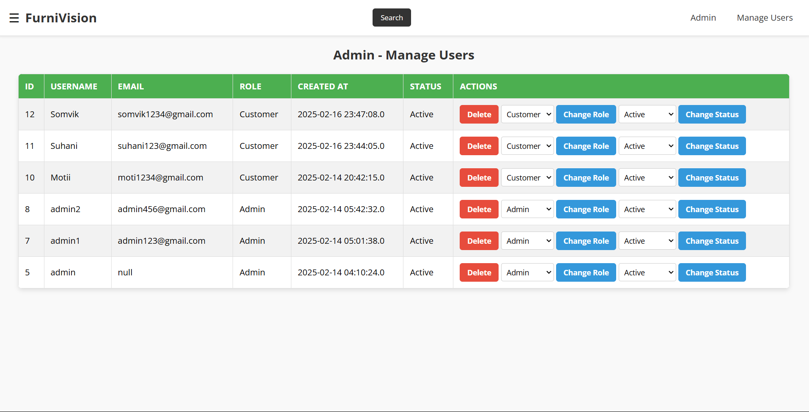


